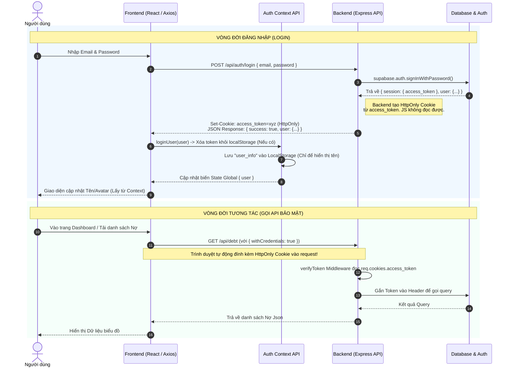

# Luồng Xác Thực (Authentication Workflow)

Tài liệu này mô tả kiến trúc xác thực (Authentication) mới an toàn theo tiêu chuẩn, sử dụng `HttpOnly Cookies` để chứa Token, và `AuthContext` (Bộ nhớ Local RAM của React) kết hợp `localStorage` để chứa thông tin hiển thị định danh.

## Sơ đồ hoạt động (Sequence Diagram)

Sơ đồ dưới đây minh họa quá trình một người dùng đăng nhập và yêu cầu lấy dữ liệu bảo mật từ Backend:

## Các Dữ Liệu Được Lưu Trữ Ở Đâu?

Đây là phần cấu hình cực kỳ tối ưu về mặt bảo mật hiện tại:

### 1. Ở Trình Duyệt (Frontend)
- **CẤM Ttuyệt Đối:** Không giấu API Keys, access_token ở dạng thô trong LocalStorage.
- **LocalStorage (`user_info`):** Chỉ lưu một Object nhỏ ghi đè Tên (`name`), Email (`email`), Avatar (`avatar`), Role người dùng. Ví dụ: `{"email": "name@gmail.com", "role": "authenticated"}`.
  - *Mục đích:* Khi người dùng F5 tải lại trang, React Context lấy dữ liệu này ra để hiển thị Header ngay lập tức mà không phải chờ Backend. 
- **DOM / Memory (AuthContext):** Biến `const { user } = useAuth();` nằm ở RAM. Khi tab đóng, RAM sẽ được dọn. Khi mở lại, nó lấy lại từ `user_info` ở LocalStorage.

### 2. Ở Nơi Giao Tiếp (Transport Layer)
- **HttpOnly Cookies (`access_token`):** Cái mấu chốt để hệ thống có biết người dùng đã đăng nhập hay chưa? Token này **nằm trong Cookie của trình duyệt** nhưng Javascript không thể chạm vào. Mỗi khi Axios `api.ts` gọi GET/POST, trình duyệt tự động móc Cookie này nhét vào yêu cầu một cách kín đáo vô hình.

### Lợi Ích:
Bạn hoàn toàn bất khả xâm phạm trước **Cross-Site Scripting (XSS)**. Hacker có móc móc LocalStorage thì cũng chỉ biết được Email của bạn, chứ không lấy được Chìa Khóa màng lưới (`access_token`) để tống tiền Database của chúng ta!
